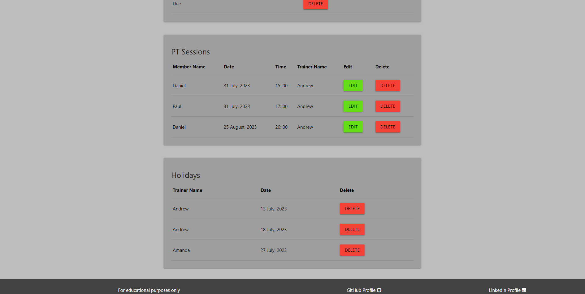

# **Elite PT Pro**

This website was created as the 3rd Milestone Project for Code Institute's web application development course.

[**__link to deployed site here__**](https://elite-pt-pro-a6d44ea21364.herokuapp.com/)
<br><br>


<br><br>

# Contents

* [User Experience](#user-experience-ux)
    * [Owner Goals](#owners-goals)
    * [Visitor Goals](#visitor-goals)
* [Design](#design)
    * [Wireframes](#wireframes)
    * [Database Schema](#database-schema)
    * [Materialize](#materialize)
    * [Images](#images)
* [Features](#features)
    * [Multi-page Features](#multi-page-features)
    * [All User Features](#all-user-features)
    * [Member Level Features](#member-level-features)
    * [Trainer Level Features](#trainer-level-features)
    * [Admin Level Features](#admin-level-features)
    * [Member/Trainer/Admin Level Features](#membertraineradmin-level-features)
    * [Error Pages](#error-pages)
    * [CRUD Functionality](#crud-functionality)
    * [Future Implementation](#future-implementation)
* [Technologies](#technologies)
    * [Languages](#languages)
    * [Tools](#tools)
* [Testing](#testing)
* [Deployment](#deployment)
    * [Deployment to Heroku](#deployment-to-heroku)
    * [Forking Repository](#forking-the-github-repository)
    * [Make Local Clone](#making-a-local-clone)
    * [Version Control](#version-control)
* [Credits](#credits)

<br><br>

# User Experience

A local gym "Elite Fitness" require an app for their members to easily book and manage PT sessions, and for thier Personal trainers to keep a track of upcoming sessions.
<br><br>

## Owners Goals
- Give my small gym clients a system to book 1 hour pt sessions
- Give my pt employees a system to track booked sessions
<br><br>

## Visitor Goals
As user:
- I want to immediately identify the purpose of the site
- I want navigation to be simple and intuitive
- I want to be able to view the site on any device
- I want to be able to easily navigate to the homepage incase of broken link or site error
<br><br>

As a logged out user: 
- I want to be able to login/signup to the service
<br><br>

As a logged in gym member user:
- I want to be able to book a 1 hour pt session
- I want to be able to see sessions I have currently booked and edit/delete them
<br><br>

As an employee/pt user:
- I want to be able to see what sessions users have booked with me
- I want to be able to set days that im unavailable for
- I want to be able to edit/delete user sessions I cannot make
<br><br>

As a managment user
- I want to be able to edit/delete users both members of gym and trainers
- I want to be able to manage Holidays of the trainers
- I want to be able to see all sessions booked with pt employees and edit/delete them
<br><br>

# Design

## WireFrames 

Wireframes created using balsamiq.

<details>
<summary>Homepage Desktop</summary>
<br>

</details>
<details>
<summary>Homepage Mobile</summary>
<br>

</details>
<details>
<summary>Register Desktop</summary>
<br>

</details>
<details>
<summary>Register Mobile</summary>
<br>

</details>
<details>
<summary>Login Desktop</summary>
<br>

</details>
<details>
<summary>Login Mobile</summary>
<br>

</details>
<details>
<summary>My Sessions Desktop</summary>
<br>

</details>
<details>
<summary>My Sessions Mobile</summary>
<br>

</details>
<details>
<summary>PT Sessions Desktop</summary>
<br>

</details>
<details>
<summary>PT Sessions Mobile</summary>
<br>

</details>
<details>
<summary>Book/Edit Session Desktop</summary>
<br>

</details>
<details>
<summary>Book/Edit Session Mobile</summary>
<br>

</details>
<details>
<summary>Add/Edit Holiday Desktop</summary>
<br>

</details>
<details>
<summary>Add/Edit Holiday Mobile</summary>
<br>

</details>
<details>
<summary>Add/Edit Holiday Desktop</summary>
<br>

</details>
<details>
<summary>Add/Edit Holiday Mobile</summary>
<br>

</details>
<details>
<summary>Add/Edit Holiday Desktop</summary>
<br>

</details>
<details>
<summary>Add/Edit Holiday Mobile</summary>
<br>

</details>
<details>
<summary>Management Desktop</summary>
<br>

</details>
<details>
<summary>Management Mobile</summary>
<br>

</details>
<br><br>

## Database Schema

Schema for PostgreSQL database was created on [Diagrams.net](https://app.diagrams.net/)
<details>
<summary>DB Schema</summary>
<br>

</details>
<br><br>

## Materialize

Materialize CSS was used and customized for the main part of the front-end development.
<br><br> 

## Images 

All images were sourced from [Unsplash](https://unsplash.com/), [Convertio](https://convertio.co/) was used to convert the images into webp and [TinyPNG](https://tinypng.com/) to compress the image even further. Main Logo in the Header was created in Adobe.
<br><br>


# Features

## Multi-page Features

### Navbar

The navbar is present across all pages ecxept for custom pages to catch errors. On mobile devices collapses to a hamburger icon which opens as a sidenav. The links visible are dependant on if the user is logged in and what level of user they are.

<details>
<summary>Navbar Logged Out</summary>
<br>

</details>
<details>
<summary>Navbar Member Logged In</summary>
<br>

</details>
<details>
<summary>Navbar Trainer Logged In</summary>
<br>

</details>
<details>
<summary>Navbar Admin Logged In</summary>
<br>

</details>
<br><br>

### Footer

Footer is present across all pages ecxept for custom pages to catch errors, with a disclaimer and links to GitHub profile and LinkedIn profile.

<details>
<summary>Footer</summary></summary>
<br>

</details>
<br><br>

### Favicon

Favicon was made by cropping the the first part of the navbar logo that was created. Made at [Favicon](https://favicon.io/).

<details>
<summary>Favicon</summary></summary>
<br>

</details>
<br><br>

### Modals

Modals are present wherever a delete button is clicked to defend against accidental deletion.

<details>
<summary>Modal</summary></summary>
<br>

</details>
<br><br>

### Log Out

Log out functionality available to all logged in users, simply clears all session cookies.
<br><br>

## All User Features

### Homepage

Homepage is available to all users but the content differs dependant on wether or not the user is logged in and what user is logged in i.e member, trainer, admin. Has an auto-slider of 4 images in the background to visually show the purpose of the site as a gym.

<details>
<summary>Homepage Logged Out</summary></summary>
<br>

</details>
<details>
<summary>Homepage Member Logged In</summary></summary>
<br>

</details>
<details>
<summary>Homepage Trainer Logged In</summary></summary>
<br>

</details>
<details>
<summary>Homepage Admin Logged In</summary></summary>
<br>

</details>
<br><br>

### Log In 

Log in form is rendered and checks for user in database and password correct. Prompt at bottom of form if not already registered with link to register page.

<details>
<summary>Log In</summary></summary>
<br>

</details>
<br><br>

### Register

Form is rendered to register for the site, checks if user is already in database, if not adds them to database and checks if "is personal trainer" is true or not if true adds to trainers table too.  Prompt at bottom of form if already registered with link to Log In page.

<details>
<summary>Log In</summary></summary>
<br>

</details>
<br><br>

## Member Level Features

These are features/pages available to registered users that are members only and not personal trainers.

### My Sessions Page

This is the page this level of user is directed to on Log In. My sessions displays the users already booked sessions in cards with buttons to edit or delete the session. Display of cards dependant on screen size.

<details>
<summary>My Sessions</summary></summary>
<br>

</details>
<br><br>

### Book Session Page

Book session page consists of a form to add a session to the database. The form requires all fields to be filled out. A list of trainers is retrieved from the database and once the trainer is selected a request is sent to retrieve a list of holidays which will be disabled in the datepicker. Once the date is selected another request is sent to retrieve a list of times already booked for that date, to prevent double bookings.

<details>
<summary>Book a Session</summary></summary>
<br>

</details>
<details>
<summary>Disabled Holidays</summary></summary>
<br>

</details>
<details>
<summary>Disabled Times</summary></summary>
<br>

</details>
<br><br>

## Trainer Level Features

### PT Sessions Page

Tghis is the page the user is directed to on Log In. Displays all sessions booked with that trainer in the database as cards with buttons to edit or delete. Displays all holidays that trainer has booked up with a button to delete holiday. Also a button to add a holiday to the database.

<details>
<summary>PT Sessions</summary></summary>
<br>

</details>
<br><br>

### Add Holiday Form

When the user clicks the add holiday form it renders the form to add a holiday to the database.

<details>
<summary>Add Holiday</summary></summary>
<br>

</details>
<br><br>

## Admin Level Features

### Manage Page

This is the page the user is directed to on Log In. Displays information from each table in the database with edit and delete buttons for the management to control users, trainers, their holidays and booked sessions. Password information for each user isn't displayed.

<details>
<summary>Manage</summary></summary>
<br>


</details>
<br><br>

### Edit User Form

Form is rendered on clicking of edit user button, prepopulated with current information stored on user.

<details>
<summary>Edit User</summary></summary>
<br>

</details>
<br><br>

## Member/Trainer/Admin Level Features

These are features that are shared by different users.

### Edit PT Session

The edit session form is almost identical to the book session form and functions in the same way sending requests to retrieve information on holidays and times on selection of trainer and date.
Displays the information on the currently booked session as a table above the form.

<details>
<summary>Edit PT Session</summary></summary>
<br>

</details>
<br><br>

## Error Pages

### 404 Page

In the event of a page not found the error handler will render a page with a link back to the homepage.

<details>
<summary>404 Error</summary></summary>
<br>

</details>
<br><br>

### 500 Page

In the event of a bad response from the server the error handler will render a page with a link back to the homepage.

<details>
<summary>500 Error</summary></summary>
<br>

</details>
<br><br>

## CRUD Functionality

| Page         | Create                                                  | Read                                                                                 | Update                                                 | Delete                                                                |
| ------------ | ------------------------------------------------------- | ------------------------------------------------------------------------------------ | ------------------------------------------------------ | --------------------------------------------------------------------- |
| Login        |                                                         | Read username for password check                                                     |                                                        |                                                                       |
| Register     | Create new instance of a User and Trainer if applicable | Read username to check if User exists                                                |                                                        |                                                                       |
| My Sessions  |                                                         | View all currently booked Sessions by User                                           | Functionality to edit booked Sessions                  | Functionality to delete booked Sessions                               |
| Book Session | Create a new instance of a Session                      | View disabled days for booked Holidays and times for booked Sessions                 |                                                        |                                                                       |
| PT Sessions  | Create new instance of a Holiday                        | View all currently booked Sessions with Trainer                                      | Functionality to edit booked Sessions                  | Functionality to delete booked Sessions and to delete Holidays        |
| Manage       |                                                         | View information from all tables in database. Users, Trainers, Holidays and Sessions | Functionality to edit booked Sessions and to edit User | Functionality to delete booked Users, Trainers, Holidays and Sessions |
<br><br>

## Future Implementation

If the project was to be developed further I would like to require the user to supply an email, so that when PT sessions are edited or deleted the user could be notified of the change and the reason why.
Also would like to add functionality to require the user to supply their gym membership number, which could be cross refrenced with the gyms existing database to check if the user signing up truly is a member of the gym.
<br><br>

# Technologies

## Languages

* HTML5 - for content and structure.
* CSS3 - for styling.
* Vanilla JS - for initialization of materialize components and for functions that request and handle data from the backend.
* Python - for the backend functionality.
    * Python Modules used -
    * blinker==1.6.2
    * click==8.1.3
    * Flask==2.3.2
    * Flask-SQLAlchemy==3.0.5
    * greenlet==2.0.2
    * itsdangerous==2.1.2
    * psycopg2==2.9.6
    * SQLAlchemy==2.0.19
    * Werkzeug==2.3.6
<br><br>

## Tools

* Convertio - used to convert images to WEBP format.
* Tinypng - used to compress images.
* Baslamiq - used to create wireframes.
* Adobe Photoshop - used to create logo.
* Diagrams.net - used to create DB schema.
* Am I Responsive - used to create responsive mockup for readme.
* Google Dev Tools - used for troubleshooting during development.
* Git/Github - used for version control and storage.
* Materialize - used for majority of frontend components.
* Favicon.io - used to create favicon.
* FontAwesome - used for icons on forms.
* Heroku - used for deployment.
<br><br>

# Testing

For testing please the [Testing](/TESTING.md) documentation.
<br><br>

# Deployment

## Deployment to Heroku

To deploy to Heroku:
1. In GitPod CLI, the root directory of the project, run:
    pip3 freeze --local > requirements.txt
    to create a requirements.txt file containing project dependencies.
2. In the Gitpod project workspace root directory, create a new file called Procfile, with capital 'P'.
    Open the Procfile. Inside the file, check that web: python3 app.py has been added when creating the file
    Save the file.
3. Push the 2 new files to the GitHub repository
4. Login to Heroku, select Create new app, add the name for your app and choose your closest region.
5. Navigate to the Deploy tab on Heroku dashboard and select Github, search for your repository and click 'connect'.
6. Navigate to the settings tab, click reveal config vars and input the following:

| Key | Value |
| :---: | :---: |
| DATABASE_URL | postgresql |
| IP | 0.0.0.0 |
| PORT | 5000 |
| SECRET_KEY | mysecretkey |

Actual Enviroment variables not disclosed for security.

## Forking the GitHub Repository
<br>

By forking the GitHub Repository we make a copy of the original repository on our GitHub account to view and/or make changes without affecting the original repository by using the following steps...

1. Log in to GitHub and locate the [GitHub Repository](https://github.com/)
2. At the top of the Repository (not top of page) just above the "Settings" Button on the menu, locate the "Fork" Button.
3. You should now have a copy of the original repository in your GitHub account.
<br><br>

## Making a Local Clone
<br>

1. Log in to GitHub and locate the [GitHub Repository](https://github.com/)
2. Under the repository name, click "Clone or download".
3. To clone the repository using HTTPS, under "Clone with HTTPS", copy the link.
4. Open Git Bash
5. Change the current working directory to the location where you want the cloned directory to be made.
6. Type `git clone`, and then paste the URL you copied in Step 3.

```
$ git clone https://github.com/YOUR-USERNAME/YOUR-REPOSITORY
```

7. Press Enter. Your local clone will be created.

```
$ git clone https://github.com/YOUR-USERNAME/YOUR-REPOSITORY
> Cloning into `CI-Clone`...
> remote: Counting objects: 10, done.
> remote: Compressing objects: 100% (8/8), done.
> remove: Total 10 (delta 1), reused 10 (delta 1)
> Unpacking objects: 100% (10/10), done.
```
<br><br>

## Version Control

Workflow controlled using Git and GitHub. It helps you track different versions of your code and collaborate with other developers. Version control allows you to keep track of your work and helps you to easily explore the changes you have made.

You can think of a repository as a “main folder”, everything associated with a specific project should be kept in a repo for that project.
You will have a local copy (on your computer) and an online copy (on GitHub) of all the files in the repository.

Once Changes on your local copy have been saved they can be added to the staging area using ```Git -add```. And then commited using ```Git commit``` along with your message, meaning they will be saved as a version of the repository which is then ready to be pushed, using ```Git push```, up to the online copy of your repository.
<br><br>

# Credits

All photos for the auto-slider on the homepage were sourced from [Unsplash](https://unsplash.com/).

* https://unsplash.com/photos/YFmvjO3TP_s - ŞULE MAKAROĞLU 
* https://unsplash.com/photos/LDAirERNzew - Valery Sysoev
* https://unsplash.com/photos/optBC2FxCfc - Sven Mieke
* https://unsplash.com/photos/IBlWVIGnXag - Ricardo Henri