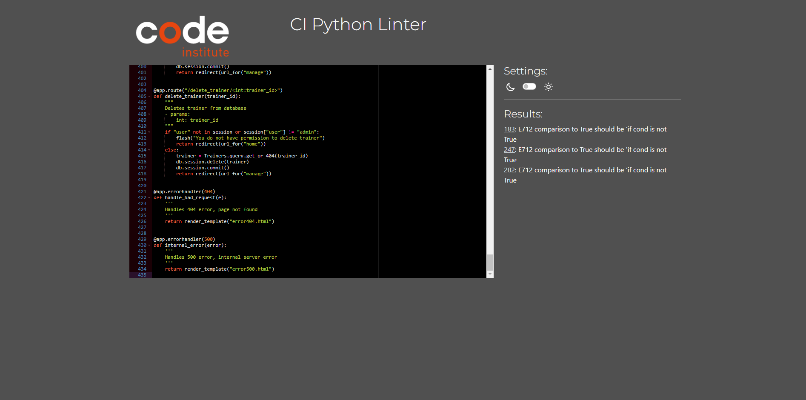
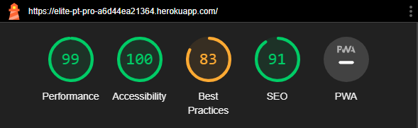

  

# Testing documentation for Elite PT Pro Web application.
  

# Contents

* [Validation](#validation)
    * [HTML Validation](#html-validation)
    * [CSS Validation](#css-validation)
    * [JS Validation](#js-validation)
    * [CI Python Linter](#ci-python-linter)
    * [Lighthouse](#lighthouse)
* [User Story Testing](#user-story-testing)

  

# Validation

## HTML Validation

All pages pass HTML Validation at [W3C markup validation service](https://validator.w3.org/) with no errors or warnings. There was 1 warning for the flash messages section didn't contain a heading which it did, so a google search suggested to change the section element into a normal div.

Homepage

 

My Sessions

 

PT Sessions

 

Manage

 

Log In

 

Register

 

Book Session

 

Edit Session

 

Add Holiday

 

404 Error

 

500 Error

 

  

## CSS Validation

All pages pass CSS Validation at [W3C CSS validation service](https://jigsaw.w3.org/css-validator/) with no errors or warnings.

CSS Validation

 

  

## JS Validation

Custom JS script file run through [JShint](https://jshint.com/) for validation. Shows 'M' variable as undefined but as this is part of the script given from the materialize documentation I have chosen to ignore it as the components work as expected.

JS Validation

 

  

## CI Python Linter

All python files run through CI PEP8 Linter and passed with no warnings, with the exception of the routes file. This file contains a conditional on line 272 which checks if user.pt is not True using the expression '!='. The linter suggests to use if not but trying to change it to this and the code doesn't work so I have chosen to overlook it. I have ommited a screenshot of the env file as not to disclose the variables for security but this also passed.

Routes.py

 

Models.py

 

__init__.py

 

Run.py

 

  

## Lighthouse

Homepage - Best practices has a lower score due to low resolution of slider images, this is intentional to reduce load time. Also for aspect ratio on logo image but in my opinion is visually ok.

 

Register - Good Scores.

 

Log In - Good Scores.

 

My Sessions - Good Scores.

 

PT Sessions - Good Scores.

 

Manage - Good Scores.

 

Book Session - Lower accessibility score due to lighthouse reporting no form labels on select elements when they are present.

 

Edit Session - Lower accessibility score due to lighthouse reporting no form labels on select elements when they are present.

 

Add Holiday - Good Scores.

Edit User - Good Scores.

404 Page - Lower SEO score due to lack of meta description but as this is just an error handler page I think it is unneccesary.

500 Page - Lower SEO score due to lack of meta description but as this is just an error handler page I think it is unneccesary.

  

# User Story Testing

## General

| User Story                                                                                | Feature                                                                                                                                    | Image |
| ----------------------------------------------------------------------------------------- | ------------------------------------------------------------------------------------------------------------------------------------------ | ----- |
| I want to immediately identify the purpose of the site.                                   | Logo in header displaying app name, background images of homepage and heading on homepage.                                                 |       |
| I want navigation to be simple and intuitive.                                             | Nav links follow standard conventions of right aligned and common hamburger icon for mobile devices. Links differ dependent on user level. |       |
| I want to be able to view the site on any device.                                         | Site is fully responsive with the aid of materialize frameworks grid system.                                                               |       |
| I want to be able to easily navigate to the homepage incase of broken link or site error. | 404 and 500 pages rendered in the case of bad links or server errors.                                                                      |
  

## Logged Out 

| User Story                                        | Feature                                                                    | Image |
| ------------------------------------------------- | -------------------------------------------------------------------------- | ----- |
| I want to be able to login/signup to the service. | Both log in and register features available, CTA on homepage or in navbar. |
  

## Logged in Member User

| User Story                                                                      | Feature                                                                                                               | Image |
| ------------------------------------------------------------------------------- | --------------------------------------------------------------------------------------------------------------------- | ----- |
| I want to be able to book a 1 hour PT session.                                  | Booking form available.                                                                                               |       |
| I want to be able to see sessions i have currently booked and edit/delete them. | My sessions page displayed all booked sessions with buttons to edit/delete. Edit button renders new form for editing. |
  

## Employee/PT User

| User Story                                                        | Feature                                                                                                         | Image |
| ----------------------------------------------------------------- | --------------------------------------------------------------------------------------------------------------- | ----- |
| I want to be able to see what sessions users have booked with me. | PT sessions page displays all booked sessions.                                                                  |       |
| I want to be able to set days that I am unavailable for.          | Add holiday button present on PT sessions page, renders form for adding holiday.                                |       |
| I want to be able to edit/delete user sessions I cannot make.     | Edit and delete buttons present on each card displaying sessions. Edit button renders form for editing session. |
  

## Management User

| User Story                                                                           | Feature                                                                                                                                                        | Image |
| ------------------------------------------------------------------------------------ | -------------------------------------------------------------------------------------------------------------------------------------------------------------- | ----- |
| I want to be able to edit/delete users both members of gym and trainers.             | All users displayed on manage page with edit and delte buttons. Edit button renders form to edit user. Trainers displayed in another table with delete button. |       |
| I want to be able to manage holidays of the trainers.                                | All holidays displayed in table with button to delete holiday.                                                                                                 |       |
| I want to be able to see all sessions booked with PT employees and edit/delete them. | All sessions booked displayed in table with edit and delete buttons. Edit button renders form to edit session.                                                 |
  